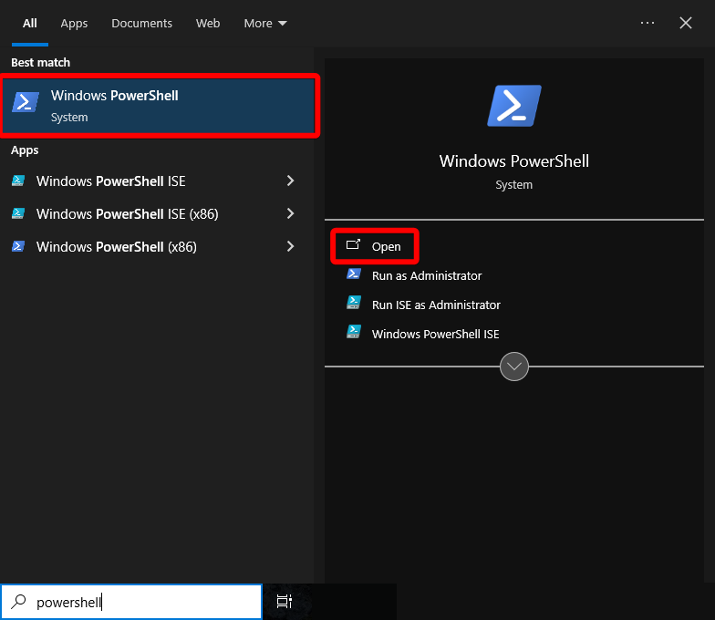
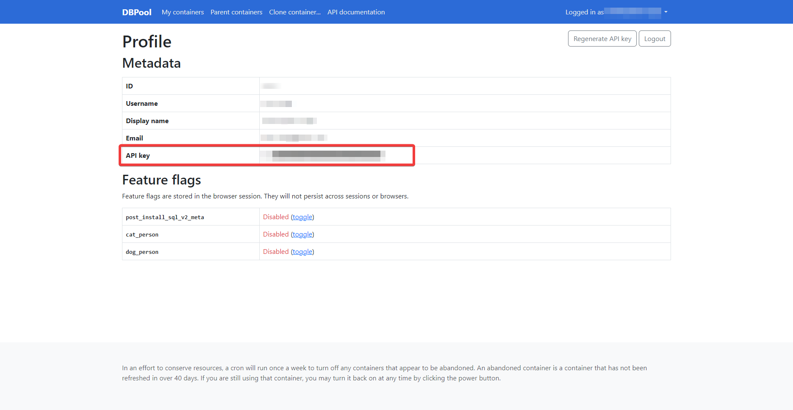
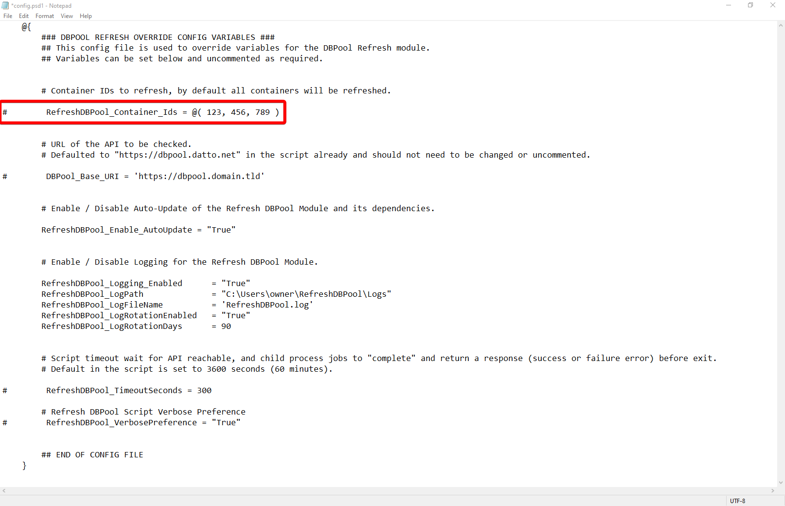

# Datto.DBPool.Refresh

This PowerShell module is used to `Refresh` all child containers in Datto (Kaseya) DBPool.

This can be combined with Scheduled Tasks in Windows or a similar Cron job to automate the refresh script on a set interval.
The recommendation is ~30 - 60 minutes prior to the start of your shift.

## Installation

### Easy Install Script

Use the following script to easily install and handle **all** dependancies.

The [install script](./src/Invoke-RefreshDBPoolInstall.ps1) is user interactive with a few prompts to set up the initial install and variables needed to automate the container refresh.

```PowerShell
$scriptFile = 'https://raw.githubusercontent.com/cksapp/Datto-DBPool_Refresh/refs/heads/main/src/Initialize-RefreshDBPool.ps1'; $fileName = [System.IO.Path]::GetFileName($scriptFile); $tempFile = [System.IO.Path]::Combine([System.IO.Path]::GetTempPath(), $fileName); if ($PSEdition -eq 'Desktop' -or $IsWindows) { Set-ExecutionPolicy Bypass -Scope Process -Force }; [System.Net.ServicePointManager]::SecurityProtocol = [System.Net.ServicePointManager]::SecurityProtocol -bor 3072; (New-Object System.Net.WebClient).DownloadFile($scriptFile, $tempFile); & $tempFile
```

1. Copy the full script
    - _This can be done via the 'Copy to Clipboard' icon_
    
2. Open PowerShell _(will work with both Windows PowerShell, and PowerShell)_
    
3. Paste the script content and enter _(sometimes it seems this may hang, in which case pressing 'Enter' or 'Spacebar' will allow continued run)_
    

---

### Install from PowerShell Gallery

If you prefer to perform step-by-step install from [Powershell Gallery](https://www.powershellgallery.com/packages/Datto.DBPool.Refresh) using the following command.

```PowerShell
Install-Module -Name Datto.DBPool.Refresh
```

## Overview

This section will detail portions of the PowerShell script and give a high-level overview of the logic.

If you would like to make any suggestions, Pull Requests are always welcome. 😄

### API Key

You will need to get your personal API key, which will be needed by the module to refresh your containers.

First login to the web-portal [https://dbpool.datto.net](https://dbpool.datto.net)

1. Select your **User Profile** at the top-right, select **My profile** from the drop-down
    
2. Under **Profile** → **Metadata** → **API key**, listed is your personal API key
    - Make a record of this in a safe-place.
    
3. Use `Set-RefreshDBPoolApiKey` to add the API key to module secret store

### Environment Override

The script is configured to check for an environment override file in the User `$HOME` directory or where specified by `Export-RefreshDBPoolModuleSetting`.

- Default location in Windows is `"$HOME\RefreshDBPool"`
- Open the configuration file using `Get-RefreshDBPoolModuleSetting -openConfFile`

Generally no changes need to be made and defaults will handle most cases.
If you wish to override any module settings this can be done within the `config.psd1` file.

- By default **ALL** containers in the DBPool will be refreshed by the script
  - The `RefreshDBPool_Container_Ids` variable can be updated with the DBPool Container Ids which you want to only be refreshed


### Automating

The module handles automation using the `Register-RefreshDBPoolTask` by creating a scheduled task in Windows to run the refresh script daily.


## Examples
